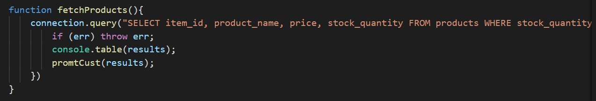
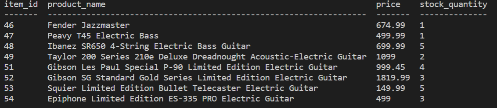
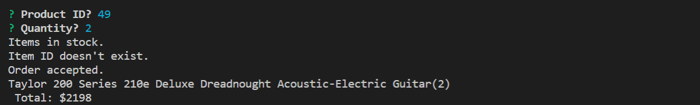

# bamazon-customer

A node and SQL based store app for customers to select products.

# A store app:

This node and SQL bassed app will allow customers to choose products from a SQL database. The user will be able to see the item id number, product name, price and quantity in the terminal. A promt question will ask for the ide number then diplay if it is available in a desired quantity. If the product is available the app will display the chosen prodect and display the price. The SQL database will be updated accordingly.

# Detail of functionality:

product display:

customer prompt:

